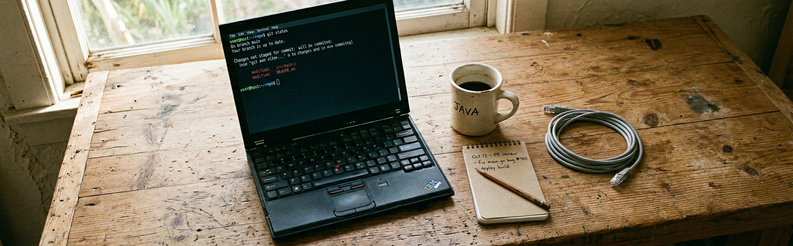

# devcli



Me he pasado años instalando sistemas operativos, una y otra vez. Cada vez acabo echando un par de horas para dejar el entorno de CLI como me gusta. En este repo tengo una herramienta que automatiza dicho proceso, parametriza el Terminal (CLI) para conseguir casi el mismo UX en **Windows: Git Bash, PowerShell, CMD** y **UX: WSL2, macOS y Linux**.

**Linux, macOS y WSL2** (lee los [requisitos](#-requisitos-linux-macos-y-wsl2)).

```console
bash <(curl -fsSL https://raw.githubusercontent.com/LuisPalacios/devcli/main/bootstrap.sh)
```

> *wget*: `bash <(wget -qO- https://raw.githubusercontent.com/LuisPalacios/devcli/main/bootstrap.sh)`

**Windows 10/11 desde Powershell 7** (lee los [requisitos para Windows](#-requisitos-windows)):

```console
iex (irm "https://raw.githubusercontent.com/LuisPalacios/devcli/main/bootstrap.ps1")
```

> Importante en Windows: Si tu antivirus corporativo (Bitdefender, CrowdStrike, etc.) bloquea el comando anterior, prueba la **instalación en dos pasos** — descarga primero, ejecuta después:
>
> ```powershell
> irm "https://raw.githubusercontent.com/LuisPalacios/devcli/main/bootstrap.ps1" -OutFile "$env:TEMP\devcli-bootstrap.ps1"
> & "$env:TEMP\devcli-bootstrap.ps1"
> ```

**Windows 10/11 desde Git Bash:**

```console
bash <(curl -fsSL https://raw.githubusercontent.com/LuisPalacios/devcli/main/bootstrap.sh)
```

> Detecta automáticamente que estás en Git Bash y delega la instalación a PowerShell 7.

<br/>

## Perfiles de instalación

Puedes elegir qué instalar con `--profile` (bash) o `-Profile` (PowerShell):

| Perfil | Contenido | Ejemplo |
|--------|-----------|---------|
| `minimal` | Herramientas esenciales: fzf, lsd, ripgrep, bat, fd, zoxide, gping, htop | `--profile minimal` |
| `dev` | minimal + desarrollo: mkcert, uv, nss, pnpm | `--profile dev` |
| `full` | Todo (por defecto): dev + kubectl, clink, quicklook | *(sin flag)* |

```bash
# Linux/macOS/WSL2 — solo lo esencial
bash <(curl -fsSL https://raw.githubusercontent.com/LuisPalacios/devcli/main/bootstrap.sh) -p minimal
```

```powershell
# Windows — perfil de desarrollo
iex "& {$(irm https://raw.githubusercontent.com/LuisPalacios/devcli/main/bootstrap.ps1)} -Profile dev"
```

### Post instalación

- Reinicia el terminal para aplicar los cambios de PATH.
- Verifica Nerd Fonts: `nerd-verify.sh` (Linux/macOS/WSL2) o `nerd-verify.ps1` (Windows).
- Si los iconos no salen bien (prueba con `lsd`), ejecuta `nerd-setup.sh` o `nerd-setup.ps1`.

<br/>

## Antes de ejecutar nada, lee esto

Este proyecto instala software, modifica archivos de configuración en tu HOME y cambia la shell por defecto. **Úsalo bajo tu propia responsabilidad.** Yo lo uso a diario en mis máquinas, pero tu entorno es diferente al mío.

**Recomendación**: antes de ejecutar el bootstrap, revisa los scripts para entender qué van a hacer en tu sistema. Son cortos y legibles. El orden de ejecución es:

| Fase | Script (Linux/macOS/WSL2) | Script (Windows) | Qué hace |
|------|--------------------------|-------------------|----------|
| Bootstrap | `bootstrap.sh` | `bootstrap.ps1` | Clona el repo, lanza las fases |
| 01 | `install/01-system.sh` | `install/01-system.ps1` | Paquetes base: git, curl, zsh, jq, oh-my-posh |
| 02 | `install/02-packages.sh` | `install/02-packages.ps1` | Herramientas CLI según perfil (fzf, bat, lsd, ...) |
| 03 | `install/03-dotfiles.sh` | `install/03-dotfiles.ps1` | Copia dotfiles: `.zshrc`, `.tmux.conf`, prompt, ... |
| 04 | `install/04-gitfiles.sh` | `install/04-gitfiles.ps1` | Configuración de Git (aliases, hooks, templates) |
| 05 | `install/05-localtools.sh` | `install/05-localtools.ps1` | Scripts auxiliares en `~/bin` |

Las herramientas que se instalan y sus métodos están declarados en [`install/tools.json`](install/tools.json). Los dotfiles que se copian están en [`install/03-dotfiles.json`](install/03-dotfiles.json). Todo es abierto y auditable.

> Si algo no te conviene, haz un fork y quita lo que no quieras. Es la gracia de que sea modular.

<br/>

## 📋 Qué hace

Enfoque modular, multiplataforma e idempotente. Un solo comando descarga el repositorio, instala las herramientas y configura el entorno.

### Herramientas base (siempre se instalan)

`git`, `curl`, `wget`, `nano`, `zsh`, `jq`, `oh-my-posh`

### Herramientas CLI (según perfil)

| Herramienta | Perfil | Descripción |
|-------------|--------|-------------|
| `htop` | core | Monitor de procesos (`bottom` en Windows) |
| `tmux` | core | Multiplexor de terminal |
| `fzf` | core | Búsqueda difusa |
| `bat` | core | `cat` con resaltado de sintaxis |
| `fd` | core | `find` moderno y rápido |
| `ripgrep` | core | `grep` ultrarrápido |
| `lsd` | core | `ls` con iconos y colores |
| `tree` | core | Árbol de directorios |
| `zoxide` | core | `cd` inteligente con historial |
| `gping` | core | `ping` con gráfico en terminal |
| `mkcert` | dev | Certificados SSL locales de desarrollo |
| `nss` | dev | Soporte NSS para mkcert |
| `pnpm` | dev | Gestor de paquetes Node.js |
| `uv` | dev | Gestor de paquetes Python (Astral) |
| `kubectl` | k8s | Cliente de Kubernetes |
| `clink` | win | Autocompletado para CMD |
| `quicklook` | win | Previsualización rápida de archivos |

### Configuración

- **Prompt**: [Oh My Posh](https://ohmyposh.dev/) con tema personalizado (`.oh-my-posh.json`), funciona en zsh, PowerShell, CMD y Git Bash.
- **Shell zsh**: `.zshrc` con aliases, fzf, zoxide y autocompletado.
- **tmux**: `.tmux.conf` con configuración personalizada.
- **PowerShell**: perfil con aliases y oh-my-posh (`Microsoft.PowerShell_profile.ps1`).
- **CMD**: aliases via clink (`cmd_aliases.cmd`, `oh-my-posh.lua`, `clink_settings`).
- **Git Bash**: `.bashrc` con oh-my-posh, zoxide, fzf, lsd y autocompletado avanzado.
- **Git**: scripts de gestión de repos (`git-config-repos.sh`, `git-status-pull.sh`).
- **Locale**: establece LANG (por defecto `es_ES.UTF-8`) en Linux, macOS y WSL2.
- **Fuentes**: instala automáticamente **FiraCode Nerd Font** para iconos en `lsd`.
- **Scripts auxiliares** en `~/bin`: `e` (editor rápido), `s` (ssh wrapper), `confcat` (muestra config sin comentarios), `nerd-setup`/`nerd-verify` (gestión de Nerd Fonts).

<br/>

## 🐧 Requisitos Linux, macOS y WSL2

> Importante: En linux solo soporta **Debian/Ubuntu** (usa `apt` para instalar software).

- Necesitas tener `curl` o `wget`.
- Necesitas `zsh` como la shell de tu usuario
  - Si no lo conoces, aquí tienes un [apunte técnico](https://luispa.com/posts/2024-04-23-zsh/) sobre ZSH en Linux y WSL2.
  - En macOS viene por defecto.
- Necesitas, en macOS, tener instalado `Homebrew` ([guía](https://brew.sh)).
- Necesitas que tu usuario tenga acceso a `sudo` sin contraseña:

    ```bash
    apt install sudo
    usermod -aG sudo <usuario>
    echo "<usuario> ALL=(ALL) NOPASSWD:ALL" > /etc/sudoers.d/10-<usuario>
    ```

- Ah!, incluso puedes ejecutar el script como `root`, útil para entornos headless.

<br/>

## 🪟 Requisitos Windows

- **PowerShell 7** o superior. Descargar desde [GitHub](https://github.com/PowerShell/PowerShell/releases) o Microsoft Store.
- `winget` (viene con Windows). Compruébalo con `winget list`.
- Recomendado preinstalar **Windows Terminal** y **Scoop**:

```powershell
# Windows Terminal
winget install Microsoft.WindowsTerminal

# Scoop (modo normal)
irm get.scoop.sh | iex

# Scoop (modo administrador, si el comando anterior te falló)
iex "& {$(irm get.scoop.sh)} -RunAsAdmin"
```

---
